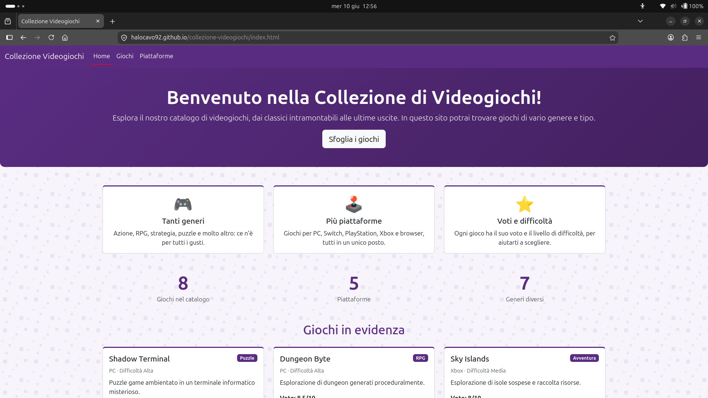
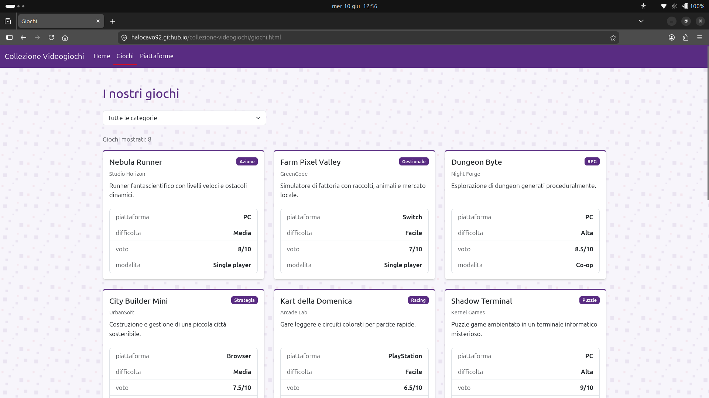
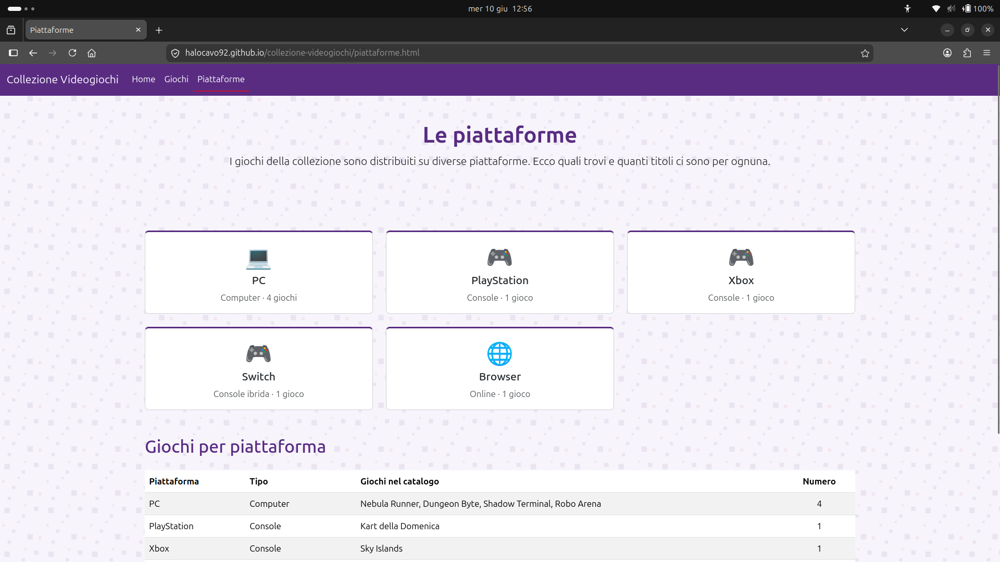
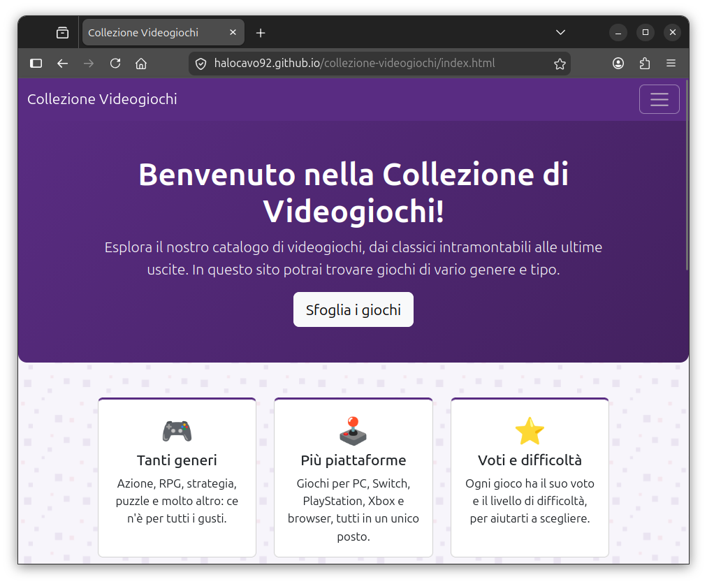

# collezione-videogiochi
esame fism 12/06/2026

Questo progetto è un catalogo multipagina di videogiochi caricati da un file `data.json`.
I giochi sono suddivisi per:
- Genere
- Piattaforma
- Difficoltà 
- Voto

## Descrizione

I file della repo costituiscono un piccolo sito web, composto da tre pagine: 

- `index.html`  --> Homepage del sito
- `giochi.html` --> Catalogo dei Giochi disponibili
- `piattaforme.html` --> Catalogo delle Piattaforme disponibili

## Funzionalità
- Elenco dei giochi mostrato nella pagina `giochi.html` come **card** generate dinamicamente da `data.json`
- **Filtro per Genere** e **contatore** dei giochi mostrati
- **Tabella riepilogativa** dei giochi (Gioco, Genere, Piattaforma, Difficoltà, Voto)
- Pagina **Piattaforme** con **card** e **tabella** delle piattaforme disponibili
- **Messaggio di errore** leggibile se `data.json` non viene caricato
- Layout **responsive** (per adattarsi alle diverse dimensioni di schermo)

## Tecnologie Utilizzate

- **HTML5** (per le pagine del sito)
- **CSS3**  (per lo stile delle pagine)
- **Bootstrap 5.3.2** (incluso da CDN)
- **JavaScript** (per caricare i dati da `data.json` e filtrare i giochi)
- **data.json** (sorgente locale per i dati dei giochi)

## Struttura della Repository

```text
collezione-videogiochi/
├── index.html          # Home
├── giochi.html         # Elenco giochi (card + tabella da data.json)
├── piattaforme.html    # Pagina piattaforme
├── style.css           # Stile personalizzato
├── script.js           # Carica data.json e genera card e tabella
├── data.json           # Dati dei giochi (API simulata)
├── LICENSE             # Licenza MIT
├── README.md
├── docs/               # Documentazione
│   ├── installazione.md
│   ├── faq.md
│   └── api.md
└── assets/
    └── immagini/       # Immagini del sito
```

## Documentazione

- [Installazione](docs/installazione.md) — come scaricare e avviare il progetto
- [FAQ](docs/faq.md) — domande frequenti
- [API](docs/api.md) — come funziona il caricamento dei dati da `data.json`

## Demo online

Versione pubblicata con GitHub Pages:
**https://halocavo92.github.io/collezione-videogiochi/**


## Screenshot

### Home


### Giochi


### Piattaforme


### Visualizzazione su schermo piccolo (responsive)



## Autore

**Stefano Cavini**


## Licenza

Questo progetto è distribuito con licenza **MIT** (vedi il file [LICENSE](LICENSE)).
Ho scelto la licenza MIT perché è semplice, permissiva e adatta a un progetto
didattico.  consente a chiunque di usare, studiare e modificare il codice
liberamente, chiedendo solo di mantenere l'avviso di copyright. È anche una
delle licenze open source più diffuse e facili da leggere.

